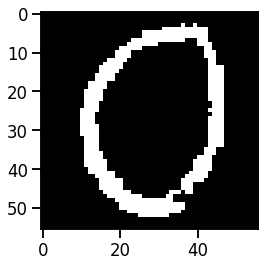
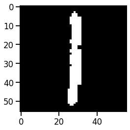
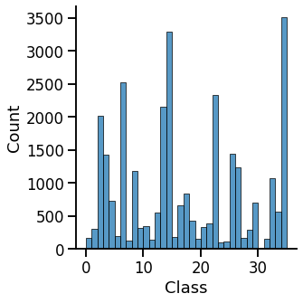

# CharacterClassifier

Recruitment assignment of creating a simple number and letter classifier.

## Data
The collection contains 30,134 binary images of 56x56 pixels, representing lettersand digits. Each picture belongs to one of 36 classes

### Examples:

### Class distribution:

## Results

| Model      | Accuracy | Macro F1|
| ----------- | ----------- | ----------- |
| Logistic regression      | 78.4 |  67.9 |
| SVM   | 87.8 |  74.4 |
| CNN   | 92.0 |  79.0 |
| EfficientNet   | **95.0** |  **88.0** |
